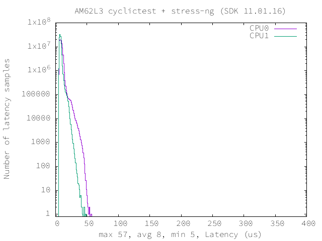

=======================================
 RT-linux 11.00.00.00 Performance Guide
=======================================

.. rubric::  **Read This First**

**All performance numbers provided in this document are gathered using
following Evaluation Modules unless otherwise specified.**

+----------------+--------------------------------------------------------------------------------------------------------+
| Name           | Description                                                                                            |
+================+========================================================================================================+
| AM62L EVM      | AM62L Starter Kit / Evaluation Module rev E1-1 with ARM running at 1250MHz, LPDDR4 data rate 1600 MT/S |
+----------------+--------------------------------------------------------------------------------------------------------+

Table:  Evaluation Modules

|

.. rubric::  About This Manual

This document provides performance data for each of the device drivers
which are part of the Process SDK Linux package. This document should be
used in conjunction with release notes and user guides provided with the
Process SDK Linux package for information on specific issues present
with drivers included in a particular release.

.. rubric::  If You Need Assistance

For further information or to report any problems, contact
https://e2e.ti.com/ or https://support.ti.com/

|

System Benchmarks
-----------------

Stress-ng and Cyclic Test

.. _RT-linux-performance:

stress-ng (next-generation) will stress test a embedded platform in various selectable ways.
It was designed to exercise various physical subsystems as well as the various
operating system kernel interfaces. stress-ng can also measure test throughput rates;
this can be useful to observe performance changes across different operating system or types of hardware.

Cyclictest is most commonly used for benchmarking RT systems.
It is one of the most frequently used tools for evaluating the relative performance of real-time systems.
Some performance tests which use Cyclictest are System benchmarking, Latency debugging with tracing and
approximating application performance.

Test commands used for running stress-ng and cyclictest together

.. code:: console

   stress-ng --cpu-method=all -c 4 &
   cyclictest -m -Sp80 -D6h -h400 -i200 -M -q

The following summarizes the latencies observed using the yocto based
default SDK image:

.. note::

   Using the OP-TEE TRNG driver can impact this benchmark's performance due to
   frequent context switching between Normal World (Linux) and Secure World (OP-TEE),
   that occurs when the kernel's hardware random number generator interface
   (hwrng) requests entropy from the secure TRNG to replenish the Linux entropy
   pool.

   The Linux TRNG driver can mitigate these latency spikes. This involves
   enabling the Pseudo RNG driver in OP-TEE as documented in the Foundational
   Components section: :ref:`building-optee-with-prng`, and enabling the RNG
   node in the Linux kernel device tree. This way the HW TRNG is accessed from
   the kernel itself.

.. csv-table::
   :header: "Latencies","CPU 0","CPU 1"

   "Minimum (us)","5","5"
   "Average (us)","8","7"
   "Maximum (us)","57","48"

